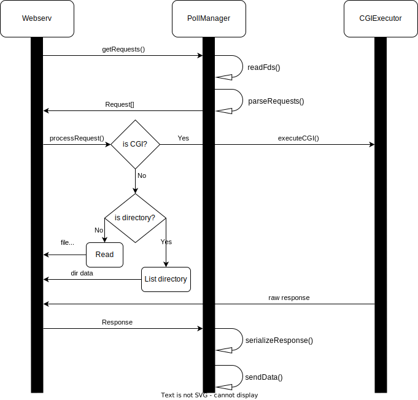

# Webserv

A simple web server written in C++.

## Development

### Diagrams

#### Class diagram


#### Sequence diagram



### Macros

- `DEBUG`: Set the debug level. The higher the level, the higher the severity of the log messages. The default level is
  3, for only error messages. Minimum level is 0, for all debug messages.
    - `0`: Debug messages
    - `1`: Info messages
    - `2`: Warning messages
    - `3`: Error messages

- `LOG_ERROR`: Log error messages.
- `LOG_WARNING`: Log warning messages.
- `LOG_INFO`: Log info messages.
- `LOG_DEBUG`: Log debug messages.

### LocationConfig builder

The location config class can be built using a builder pattern.
Here is an example:

```cpp
LocationConfig()
        .addIndex("index.html")
        .addIndex("index.php")
        .setRoot("/var/www/html")
        .setPath("/")
        .addMethod("GET")
        .addMethod("POST")
        .setDirectoryListingEnabled(true)
        .setDirectoryResponseFile("/var/www/html/.directory")
        .setCgiEnabled(true)
        .setCgiPath("/var/www/html/cgi-bin")
        .setCgiExtension(".php")
        .setUploadEnabled(true)
        .setUploadPath("/var/www/html/uploads")
```

### ServerConfig builder

The server config class can be built using a builder pattern. It has a default location config that can be set using
the `setDefaultLocation` method. This default location config will be used for all requests that do not match any
location config.
Here is an example:

```cpp
ServerConfig config = ServerConfig()
        .addListen(8080) // listen <port>
        .addListen("localhost", 8081) // listen <host>:<port>
        .setServerName("localhost") // server_name
        .setDefaultLocation(LocationConfig() // server level location config
                .addIndex("index.html") // index
                .addIndex("index.php") // index
                .setRoot("/var/www/html") // root
                .setPath("/") // location <path> { ... }
                .addMethod("GET") // methods
                .addMethod("POST") // methods
                .setDirectoryListingEnabled(true) // autoindex
                .setDirectoryResponseFile("/var/www/html/.directory") // autoindex_format
                .setCgiEnabled(true) // cgi_enabled
                .setCgiPath("/var/www/html/cgi-bin") // cgi_bin
                .setCgiExtension(".php") // cgi_ext
                .setUploadEnabled(true) // upload_enabled
                .setUploadPath("/var/www/html/uploads") // upload_path
                )
        .addLocation(LocationConfig() // for each location <path> { ... }
                .addIndex("index.html")
                .addIndex("index.php")
                .setRoot("/var/www/html")
                .setPath("/test")
                .addMethod("GET")
                .addMethod("POST")
                .setDirectoryListingEnabled(true)
                .setDirectoryResponseFile("/var/www/html/.directory")
                .setCgiEnabled(true)
                .setCgiPath("/var/www/html/cgi-bin")
                .setCgiExtension(".php")
                .setUploadEnabled(true)
                .setUploadPath("/var/www/html/uploads")
                );
```

### Request builder

The request class can be built using a builder pattern.
Here is an example:

```cpp
HttpRequest req = HttpRequest()
        .setMethod("POST")
        .setPath("/index.html")
        .setVersion("HTTP/1.1")
        .addHeader("Content-Type", MimeTypes::getType("html"))
        .addHeader("Content-Length", "12")
        .addParam("param1", "value")
        .addParam("param2", "434")
        .setBody("Hello World!");
```

### Response builder

The response class can be built using a builder pattern.
Here is an example:

```cpp
HttpResponse response = HttpResponse()
        .setVersion("HTTP/1.1")
        .setStatus(HttpStatus::OK)
        .addHeader("Content-Type", MimeTypes::getType("html"))
        .addHeader("Content-Length", "12")
        .setBody("Hello World!");
```

### Build

```bash
make
```

### Run

```bash
./webserv [config_file]
```

